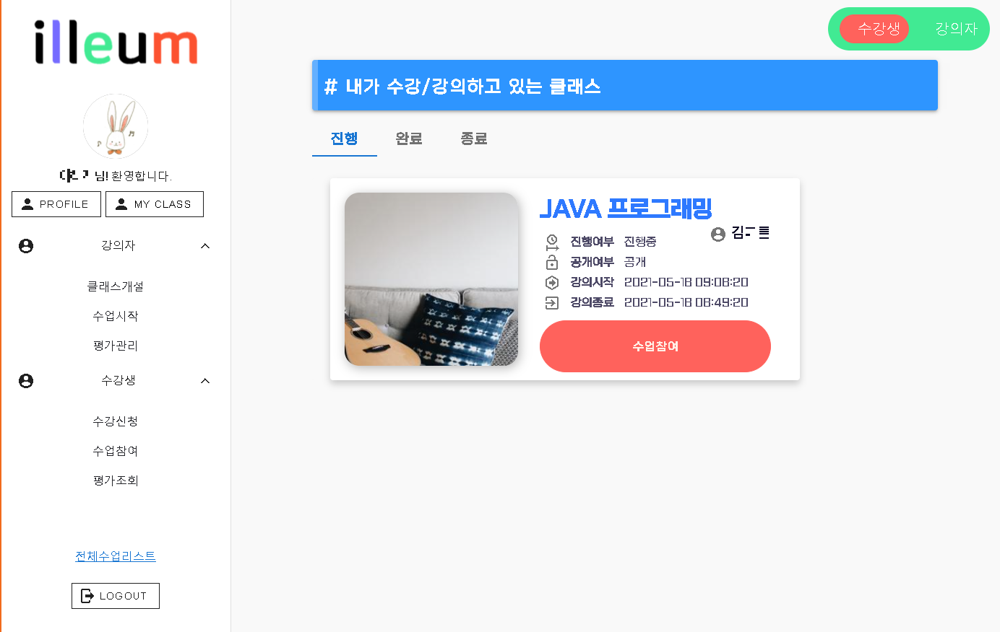
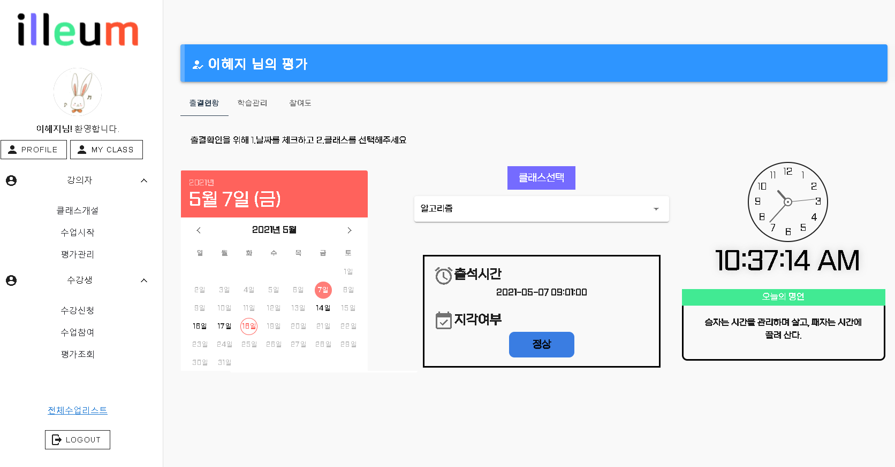
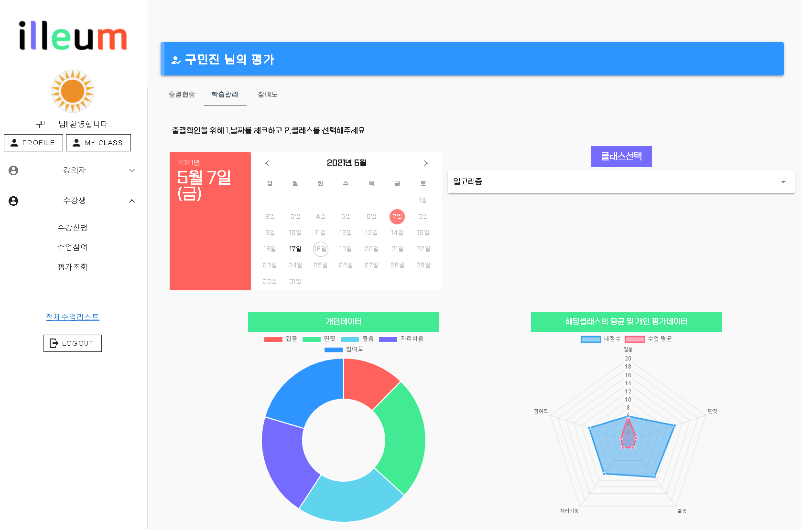
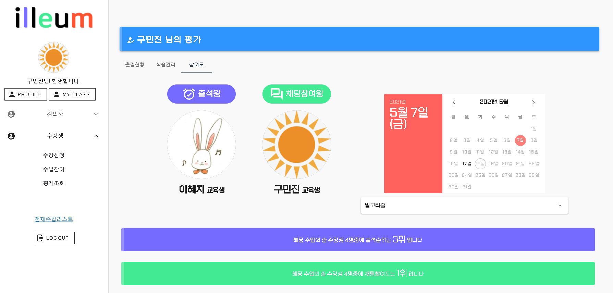
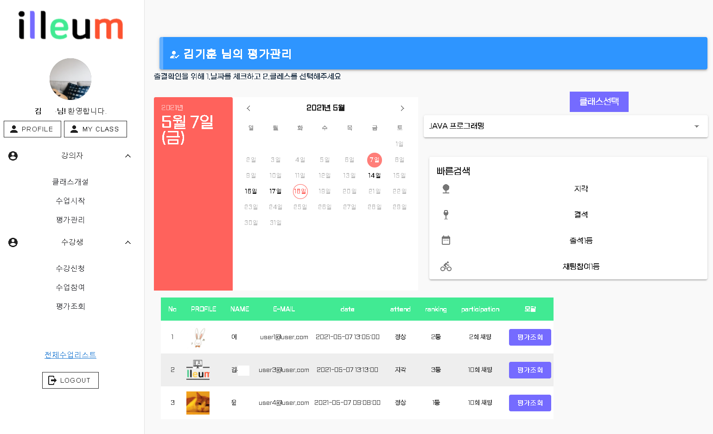
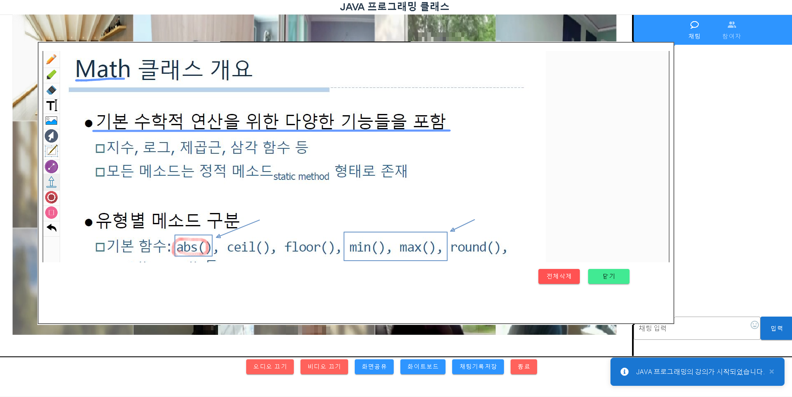
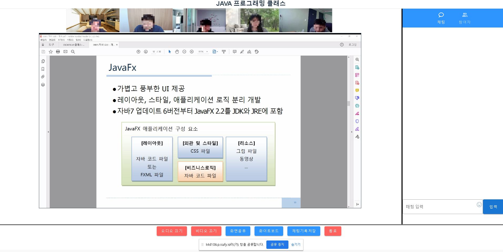
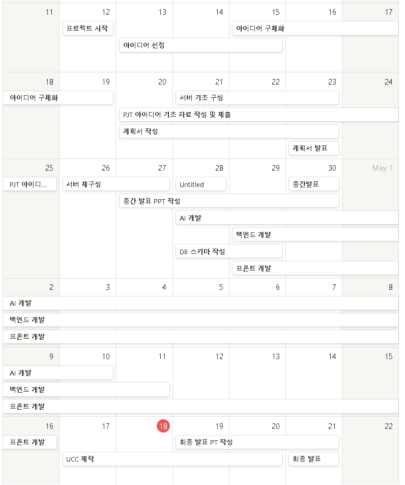

# 인공지능 보조 교육 화상 플랫폼 : illeum

> illeum은 인공지능을 활용한 교육 목적의 화상 플랫폼

<여기에 기술 스택 뱃지 달 예정>

# 🎨 What's "illeum"?

illeum은 인공지능을 활용한 교육 목적의 화상 플랫폼으로 기존 화상 플랫폼에 대해 **출석체크, 수업태도, 수업참여도** 에 대한 자동화함으로서 교육자가 추가적인 수강생의 지적과 파악을 할 필요 없이 온전히 수업에만 몰두할 수 있도록 하는 것이 목적인 **화상 플랫폼**입니다.

## 💬 Features

---

- 온라인 화상회의/ 화상미팅 서비스

  - webRTC 기술을 사용하여 양질의 양방향 소통이 가능한 서비스 제공

- 수업 태도 자동 관리
  - 개개인의 수업 태도를 AI 시스템이 직접 판별하여 수업태도를 관리하고, 필요한 경우 해당 교육생과 강의자에게 알람을 주어 수업의 집중도를 올릴 수 있는 차별화된 서비스 제공
  - 강의 종료 후, 각 교육생의 수업 태도 및 참여도를 시각적 도표로 비교/분석할 수 있는 기능 제공

## 🖼️ Preview

---

















# 📚 Settings

`💡 해당 서비스는 Linux 환경에서 최적화 되어 있습니다.`

1.  /volumes 폴더를 생성 또는 마운트하여 폴더 권한을 가져옵니다.

    ```bash
    $ sudo mkdir /volumes
    $ sudo chown -R [사용자명][:그룹명] /volumes
    ```

2.  HTTPS통신을 위한 SSL 인증서를 발급 받습니다. `fullchain.pem` , `privkey.pem`
    💡 openSSL, letsencrypt 을 통해 발급 받아서 처리할 수 있으며,
    기존의 SSL 인증서가 존재한다면 해당 인증서를 활용하시기 바랍니다.

        ```bash
        $ sudo apt-get update
        $ sudo apt-get install letsencrypt
        $ sudo letsencrypt certonly --standalone -d [도메인 네임]
        ```

3.  SSL 인증서를 /volumes/front_home/key 폴더에 이동합니다.

    ```bash
    $ sudo mkdir volumes/front_home/key
    $ sudo cp /etc/letsencrypt/live/<도메인 네임>/fullchain.pem /volumes/front_home/key
    $ sudo cp /etc/letsencrypt/live/<도메인 네임>/privkey.pem /volumes/front_home/key
    ```

4.  docker, docker-compose를 설치합니다.

    ```bash

    $ sudo apt-get install curl
    $ curl https://get.docker.com | sudo sh

    $ sudo curl -L "https://github.com/docker/compose/releases/download/1.27.0/docker-compose-$(uname -s)-$(uname -m)" -o /usr/local/bin/docker-compose
    $ sudo chmod +x /usr/local/bin/docker-compose
    $ sudo ln -s /usr/local/bin/docker-compose /usr/bin/docker-compose
    ```

5.  프로젝트를 클론 합니다.

    ```bash
    $ sudo git clone https://lab.ssafy.com/s04-final/s04p31d106.git
    ```

# 🖥️ Distribute

해당 서비스는 AWS EC2를 통해 배포하였고 Docker와 Jenkins를 이용해 CI/CD 구축하였습니다:

1. AWS EC2 인스턴스 생성 (ubuntu)
2. (docker 설치)
3. 필요한 이미지를 docker hub를 통해 설치

   ```bash
   $ sudo cd ./server
   $ sudo docker-compose up -d
   ```

   1. Jenkins
      - `./server/Jenkinsfile` 을 Task Schedules 에 추가
        (일부 알림에 따른 스크립트가 필요치 않은 경우 수정)
   2. MySQL
      - MySQL 컨테이너에 `illeum` DB 스키마 생성
      - `./database/schema.sql` 을 import
   3. RabbitMQ

      - web stomp 플러그인을 활성화 하고,
        `illeum-guest/illeum-guest` 계정 생성 및 읽기 권한 부여

      ```bash
      $ rabbitmq-plugins enable rabbitmq_web_stomp
      $ rabbitmqctl add_user illeum-guest illeum-guest
      $ rabbitmqctl set_permissions -p / illeum-guest "" "" ".*"
      ```

4. 자동배포를 필요로 하는 경우 Jenkins와 Gitlab repository 연동
5. Nginx 설정 (frontend/nginx 폴더의 homepage.conf)
6. frontend, backend 폴더 안에 dockerfile 작성
7. 프로젝트 `./server` 위치에 Jenkinsfile 파일 작성
   1. Build and Test 과정
   2. Build (frontend, backend, AI)
   3. Run (컨테이너 실행)
8. `docker ps` 를 통해 frontend, backend, AI 컨테이너가 실행되는 것을 확인 (Jenkins, MySQL, RabbitMQ 포함)

# 🏃‍♂️ Progress

- 진행일자 : 2021-04-12 ~ 2021-05-18
  

# 📒 Documents

- 
- 최종 발표 PPT
- 최종 UCC

# 🚂 Contributer


- [구민진](https://github.com/guminjin)
- [김두상](https://github.com/DooSang3664)
- [윤예준](https://github.com/dbs7120)
- [이혜지](https://github.com/reverse-wisdom)
- [현진혁](https://github.com/getCurrentThread)

# 🧾 License

This software is licensed under the ⓒ [SSAFY](https://www.ssafy.com/).
